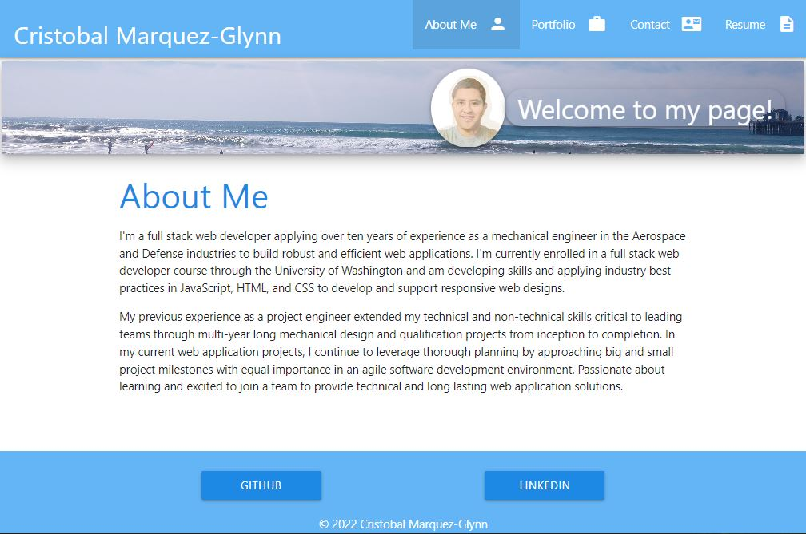

# CM-Gdev Portfolio
  

  ## Description
  
  - I created my portfolio page using my new React skills. It's a single-page application that contains information about me and most importantly it showcases some of my most recent web development applications. 
  - I used materialize css to style the final product
  
  The following screenshots demonstrate how the application appears in two different screen sizes.   

    
  
   
   
  ## Table of Contents
   
  - [Installation](#installation)
  - [Usage](#usage)
  - [Credits](#credits)
  - [License](#license)
  - [How To Contribute](#how_to_contribute)
  - [Tests](#tests)
  - [Questions](#questions)
  
  ## Installation
  
  To install my application's code, visit my [GitHub](https://github.com/CM-GDev/react-cmg-dev-portfolio) repository page
   
  ## Usage
  
  I have also deployed my application to gitHub pages: [Portfolio](https://cm-gdev.github.io/react-cmg-dev-portfolio/)   
    
  ## Credits

  For this homework assignment, I relied on Materialize CSS framework documentation: [Materialize](https://materializecss.com/)  
  
  ## License
  
  MIT License

  Copyright (c) [2022] [Cristobal Marquez-Glynn]
  
  ## How to Contribute
  
  - [Contributor Covenant](https://www.contributor-covenant.org/) 
  - I'm open to suggestions on how to improve this product.
  
  ## Tests
  
  N/A
  
  ## Questions
   
  For any questions, you can reach me through my [GITHUB](https://github.com/CM-GDev) or email: cristobalmqz@gmail.com account. 
